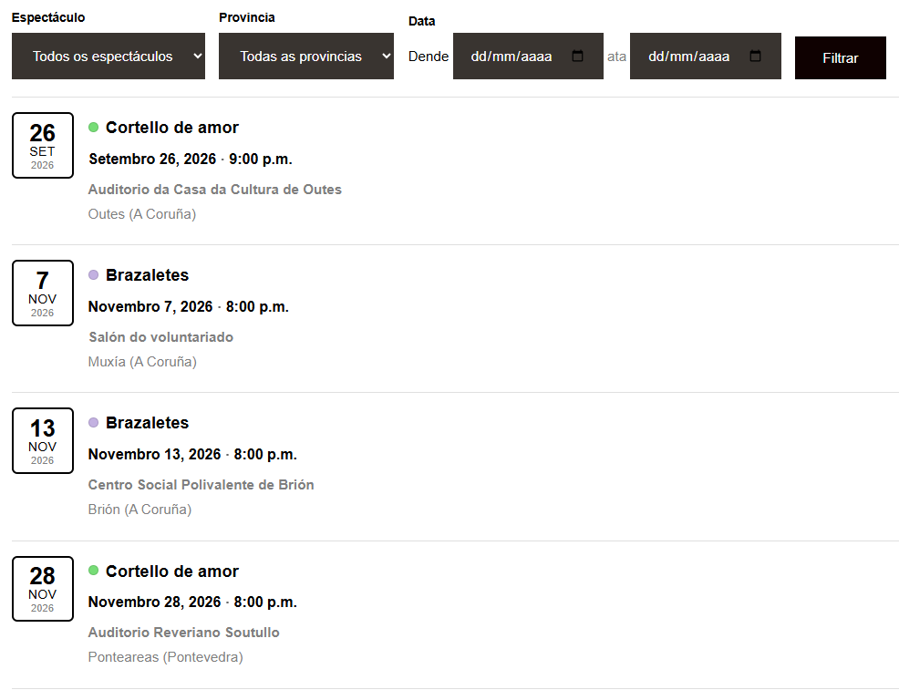

<div align="center">

<h1>
    <table border="0">
    <tr border="0">
        <td align="center" valign="middle" border="0">
        <picture>
            <source media="(prefers-color-scheme: dark)" srcset="https://cdn.simpleicons.org/wordpress/white">
            
        </picture>
        </td>
        <td valign="middle" border="0">
        <strong>Wordpress</strong><br>
        Events calendar
        </td>
    </tr>
    </table>
</h1>

**Plugin de WordPress para xestionar eventos, localizacións e espectáculos e amosar a lista de eventos na web cun shortcode.**




</div>

## Por que

Naceu para substituír [**Modern Events Calendar**](https://wordpress.org/plugins/modern-events-calendar-lite/) nunha web de teatro que só precisaba unha lista de funcións (espectáculo, data, hora e lugar) sen toda a carga dun calendario completo.

## Funcionalidades

- Catro menús de administración: **Eventos**, **Localizacións**, **Espectáculos** e **Shortcodes**.
- Eventos dun día ou de varios (data de inicio e de fin), con hora opcional: se non ten hora, non se amosa.
- Localizacións con provincia, concello, nome do local e enderezo; espectáculos con nome, URL a unha páxina da web e unha cor para identificalos na lista.
- Shortcode `[eventos]` con filtros (próximos / pasados / todos, límite, espectáculo, localización, provincia, concello).
- Menú **Shortcodes** para crear shortcodes propios (nome, eventos próximos / pasados / todos, número máximo e filtro).
- Filtro opcional enriba da lista pública para que os visitantes busquen por espectáculo, provincia e datas.
- Filtros e buscador de texto en todos os listados do panel.
- **Importar / Exportar** en XML: importa e exporta todo para copias de seguridade ou para pasar os datos a outra web.
- **Importar / Exportar** só os espectáculos (nome e URL) dende a pantalla de Espectáculos.
- Non deixa borrar localizacións nin espectáculos que estean en uso.
- Traducíbel (`.pot` incluído; traducións ao galego e ao castelán incluídas).
- Datas e horas co formato e o idioma configurados no sitio.
- Estilo personalizábel con variables CSS, sen tocar o código do plugin.


## Configuración

### Requisitos

| | |
|---|---|
| WordPress | 5.8 ou superior |
| PHP | 7.4 ou superior (con `SimpleXML` e `DOM` para importar / exportar) |
| Base de datos | MySQL / MariaDB (a de calquera instalación estándar) |

### Instalación: Opción A — Subir un ZIP dende o escritorio

1. Comprime a carpeta do plugin nun ficheiro `.zip`.
2. No escritorio de WordPress: **Plugins → Engadir novo → Subir complemento**.
3. Escolle o ZIP, preme **Instalar agora** e despois **Activar**.

### Instalación: Opción B — FTP ou xestor de ficheiros do aloxamento

1. Sube a carpeta completa a `wp-content/plugins/wp-events-calendar/`.
2. No escritorio: **Plugins** e activa **WP Events Calendar**.

Ao activar, o plugin crea automaticamente as súas táboas na base de datos (`wp_wpec_events`, `wp_wpec_locations`, `wp_wpec_shows` e `wp_wpec_shortcodes`). Se o esquema cambia nunha versión nova, actualízase só no seguinte `plugins_loaded`.

## Uso

### 1. Rexistrar localizacións e espectáculos

Antes de crear un evento cómpre ter polo menos unha localización e un espectáculo:

- **Eventos → Localizacións**: provincia, concello, nome do local e enderezo.
- **Eventos → Espectáculos**: nome, URL e cor. O campo URL suxire as páxinas publicadas da web para ligar o espectáculo á súa páxina.

A cor escóllese entre 10 e amósase nun círculo pequeno diante do nome do espectáculo na lista pública para identificalo máis rápidamente.

Na pantalla de Espectáculos, o botón **Importar / Exportar** permite descargar só os espectáculos nun XML e importalos noutra web. Ao importar créanse os que non existen (compáranse polo nome, sen ter en conta maiúsculas nin acentos); os que xa existen non se cambian, agás para engadirlles a URL se non tiñan.

Só os usuarios con permiso `edit_pages` (editores e administradores) poden xestionalos.

### 2. Engadir eventos

En **Eventos → Eventos** escolle data de inicio, data de fin (baleira se dura un só día), hora, localización e espectáculo.

> Se deixas a hora baleira, na lista pública só se amosa a data.

Todos os listados teñen unha barra de filtros:

| Listado | Filtros |
|---|---|
| Eventos | Espectáculo, localización, rango de datas (dende / ata) e buscador |
| Localizacións | Provincia, concello (só os da provincia escollida) e buscador |
| Espectáculos | Espectáculo e buscador |

O buscador atopa coincidencias en todas as columnas do listado.

### 3. Amosar os eventos na web

O shortcode é:

```
[eventos]
```

| Onde | Como |
|---|---|
| Editor de bloques | Bloque **Shortcode** con `[eventos]` |
| Widgets | Bloque de texto ou HTML co shortcode |
| Tema clásico | `<?php echo do_shortcode('[eventos]'); ?>` no modelo que queiras |
| Elementor e outros construtores | Widget **Shortcode** co mesmo texto |

Atributos opcionais:

| Atributo | Valores | Por defecto |
|---|---|---|
| `mostrar` | `proximos`, `pasados`, `todos` | `proximos` |
| `limite` | número máximo de eventos (`0` = todos) | `0` |
| `orden` | `asc`, `desc` | `asc` (`desc` para pasados) |
| `espectaculo` | ID dun espectáculo | — |
| `localizacion` | ID dunha localización | — |
| `provincia` | nome da provincia | — |
| `ayuntamiento` | nome do concello | — |
| `vacio` | texto cando non hai eventos | «Non hai eventos programados.» |
| `filtro` | `si`, `no`: filtro por espectáculo, provincia e datas enriba da lista | `no` |

```
[eventos limite="5"]
[eventos mostrar="pasados" limite="10"]
[eventos provincia="Pontevedra"]
[eventos filtro="si"]
```

Os atributos admiten tamén nomes en inglés e galego (`show` / `amosar`, `limit`, `order` / `orde`, `municipality` / `concello`, `empty` / `baleiro`, `filter`…), e hai os alias `[wpec_eventos]` e `[wpec_events]` por se outro plugin xa usa `[eventos]`.

### 4. Importar / Exportar

No listado de eventos, o botón **Importar / Exportar** abre unha pantalla con dúas seccións:

- **Importar**: sube un XML como o que está na raiz (`exemplo.xml`). Antes de gardar nada amósase unha vista previa onde:
  - cada título do XML se asigna a un espectáculo existente, a un novo (por defecto o título sen o ano: `Cortello de amor 2025` → `Cortello de amor`) ou a **Non importar**;
  - vense as localizacións que xa existen e as que se van crear (compáranse concello e local, sen ter en conta maiúsculas nin acentos).
- **Exportar**: descarga un XML con todos os eventos, localizacións e espectáculos. Ten o mesmo formato que acepta o importador, así que serve como copia de seguridade ou para levar os datos a outra web sen perder nada.

> Os eventos que xa existen (mesma data, localización e espectáculo) omítense, así que importar dúas veces o mesmo ficheiro non duplica nada.

### 5. Crear shortcodes personalizados

En **Eventos → Shortcodes** podes crear shortcodes propios para non ter que lembrar os atributos. Cada un ten:

| Campo | Para que serve |
|---|---|
| Nome | Nome descritivo, por exemplo «Próximas funcións». |
| Shortcode | A etiqueta que se pega na páxina. Se o deixas baleiro, créase a partir do nome (`[proximas_funcions]`). Só letras, números e guións baixos. |
| Eventos que amosar | **Próximos**, **Pasados** ou **Todos**. |
| Número máximo de eventos | Cantos eventos amosa como máximo (`0` = sen límite). |
| Filtros | Se está marcado, amosa un filtro enriba da lista. |

Na lista, o botón **Copiar** copia o shortcode para pegalo directamente nunha páxina ou entrada:

```
[proximas_funcions]
```

Tamén acepta os mesmos atributos que `[eventos]` para cambiar algo puntualmente, por exemplo `[proximas_funcions limite="1"]`.

#### Filtro da lista

Cando un shortcode ten **Filtros** activado (ou `filtro="si"`), enriba da lista aparece un formulario con:

- **Espectáculo** e **Provincia**: só ofrecen os que teñen eventos nese shortcode. Se só hai unha opción, ou se o shortcode xa filtra por ese campo (`espectaculo`, `provincia`, `ayuntamiento` ou `localizacion`), o despregable non se amosa.
- **Data**: rango *dende / ata*; amosa os eventos que caen, polo menos en parte, dentro del.

O filtro recarga a mesma páxina (parámetros `ev_espectaculo`, `ev_provincia`, `ev_dende` e `ev_ata` na URL, polo que se pode compartir a ligazón filtrada) e volve á altura da lista. O límite de eventos aplícase despois de filtrar. Se hai varios shortcodes con filtro na mesma páxina, cada un usa os seus propios parámetros (`ev2_…`, `ev3_…`) e non se mesturan.

> Non se pode usar un nome que xa use outro shortcode deste plugin, `[eventos]`, WordPress, outro plugin ou o tema. Se máis adiante outro plugin empeza a usar o mesmo, a lista avísao en vermello.

### Personalización (CSS)

O aspecto da lista sae de variables CSS definidas en `assets/css/wpec-public.css`. Podes sobrescribilas no CSS do teu tema sen tocar o plugin:

```css
.wpec-events {
  --wpec-accent: #c0392b;                    /* borde do bloque da data */
  --wpec-border: rgba(127, 127, 127, 0.25);  /* liñas entre eventos */
  --wpec-muted: #777777;                     /* texto secundario (localización, ano) */
}
```

O filtro usa as clases `.wpec-filter`, `.wpec-filter__field` e `.wpec-filter__submit`, e o círculo da cor do espectáculo, `.wpec-color`.

Para cambiar o HTML de cada evento está o filtro `wpec_event_html( $html, $event, $atts )`, e para cambiar quen pode xestionar o calendario, `wpec_capability` (por defecto `edit_pages`).

## Preguntas frecuentes

**O plugin segue en castelán (ou en inglés) nunha web en galego.**
Comproba que estea subido o cartafol `languages/`. As traducións cárganse segundo o idioma da web ou o do perfil do usuario no escritorio. Só hai `gl_ES` e `es_ES`: calquera outro idioma (tamén `es_MX`, `es_AR`…) amósase en inglés ata que se engada o seu `.po` / `.mo`.

**Un evento non amosa a hora.**
É intencionado: se o campo **Hora** está baleiro, a lista só amosa a data. Os eventos importados con `hide_time` ou `allday` quedan sen hora.

**Non me deixa borrar unha localización ou un espectáculo.**
Hai eventos que o usan. Cambia ou elimina eses eventos primeiro; así non quedan eventos sen lugar nin espectáculo.

**Ao importar, un evento non aparece.**
Os eventos sen localización non se importan, e os que xa existen omítense. O resumo final da importación indica cantos se saltaron e por que.

**O filtro non amosa o despregable de espectáculos (ou de provincias).**
Só aparece se hai polo menos dúas opcións entre os eventos dese shortcode e se o propio shortcode non filtra xa por ese campo.

**Un espectáculo non ten o círculo de cor.**
Os espectáculos creados antes da versión 1.1.0 quedan en **Sen cor**. Edítao, escolle unha cor e garda.

**Outro plugin xa usa `[eventos]`.**
Usa `[wpec_eventos]` ou `[wpec_events]`: funcionan igual e aceptan os mesmos atributos.

## Estrutura do proxecto

```
wp-events-calendar/
├── wp-events-calendar.php          # Cabeceira do plugin, constantes, carga de traducións e clases
├── uninstall.php                   # Borra táboas e opcións ao desinstalar
├── includes/
│   ├── class-wpec-db.php           # Táboas e consultas (eventos, localizacións, espectáculos, shortcodes)
│   ├── class-wpec-admin.php        # Menús, listados con filtros e formularios do escritorio
│   ├── class-wpec-importer.php     # Importación de XML con vista previa
│   ├── class-wpec-exporter.php     # Exportación de todo a XML
│   └── class-wpec-shortcode.php    # Shortcode [eventos] e HTML da lista
├── assets/
│   ├── css/
│   │   ├── wpec-public.css         # Estilos da lista, do filtro e variables de personalización
│   │   └── wpec-admin.css          # Estilos do escritorio
│   ├── js/
│   │   └── wpec-admin.js           # Despregable de concellos segundo a provincia e botón Copiar
│   └── img/                        # Capturas de mostra
├── languages/                      # .pot e traducións gl_ES / es_ES (.po, .mo, .l10n.php)
└── LICENSE
```

## Historial de versións

| Versión | Cambios |
|---|---|
| 1.1.0 | Cor para cada espectáculo e opción **Filtros** nos shortcodes. |
| 1.0.0 | Versión inicial. |

## Licenza

GPL-2.0-or-later. Consulta o ficheiro [LICENSE](LICENSE).

## Autor

[Ismael Castiñeira](https://ipardelo.es)

```bash
VIVA GHALISIA E A COSTA DA MORTE! 💀
```
